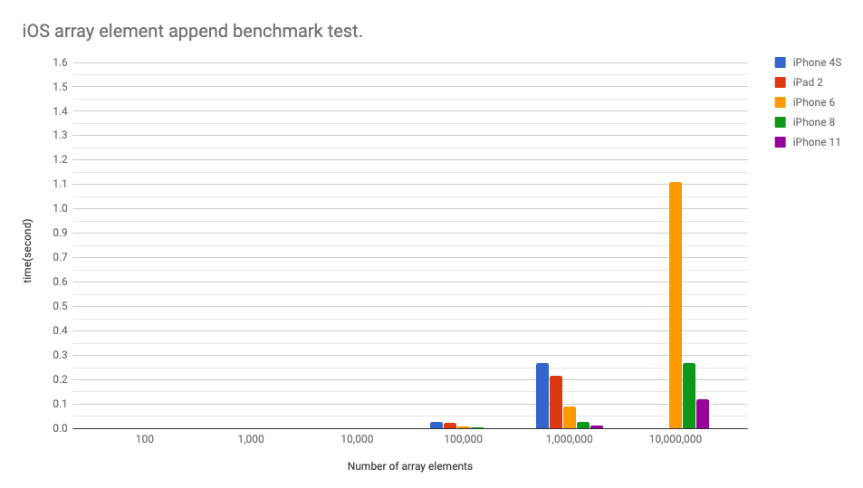
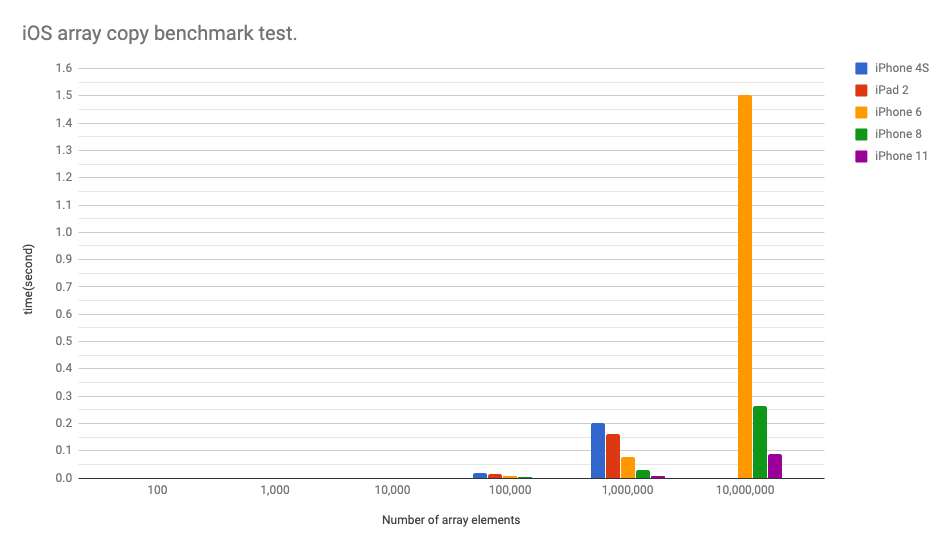

# iOSBench
iOS benchmark test project.
Let's measure the array's Append, Copy and so on.

# iOS array benchmark test.

## What to do 


- Measure the time to append a string to an array.
- Measure the time to copy the whole array.
- Array is [String].
- Array element is string of 8192 chars.

# Result

## Array element append time

```
var ary:[String]=[]
for _ in 0..<elementnum {
	ary.append(str)
}
```


| element num | iPhone 4S | iPad 2 | iPhone 6 | iPhone 8 | iPhone 11 |
<<<<<<< HEAD
| --: | --: | --: | --: | --: | --: |
=======
| --- | --- | --- | --- | --- | --- |
>>>>>>> origin/master
| 100 | 0.000168 | 0.000132 | 0.000021 | 0.000033 | 0.000013 |
| 1,000 | 0.000351 | 0.000244 | 0.000149 | 0.000158 | 0.000052 |
| 10,000 | 0.002693 | 0.002126 | 0.001096 | 0.000746 | 0.000421 |
| 100,000 | 0.030319 | 0.024377 | 0.010073 | 0.005513 | 0.002554 |
| 1,000,000 | 0.288408 | 0.232506 | 0.097534 | 0.028650 | 0.012487 |
| 10,000,000 | - | - | 1.079544 | 0.287714 | 0.128208 |


- The unit is seconds.
- IPhone 4S and iPad 2 crashed at 10,000,000 elements.




## Array copy time

```
var newarray = orginalarray
```


| element num | iPhone 4S | iPad 2 | iPhone 6 | iPhone 8 | iPhone 11 |
<<<<<<< HEAD
| --: | --: | --: | --: | --: | --: |
=======
| --- | --- | --- | --- | --- | --- |
>>>>>>> origin/master
| 100 | 0.000019 | 0.000015 | 0.000008 | 0.000010 | 0.000004 |
| 1,000 | 0.000182 | 0.000140 | 0.000093 | 0.000091 | 0.000037 |
| 10,000 | 0.002157 | 0.001733 | 0.000742 | 0.000586 | 0.000305 |
| 100,000 | 0.021624 | 0.017862 | 0.007353 | 0.003594 | 0.001542 |
| 1,000,000 | 0.215247 | 0.174091 | 0.081172 | 0.030677 | 0.009397 |
| 10,000,000 | - | - | 1.496943 | 0.279934 | 0.095515 |


- The unit is seconds.
- IPhone 4S and iPad 2 crashed at 10,000,000 elements.


